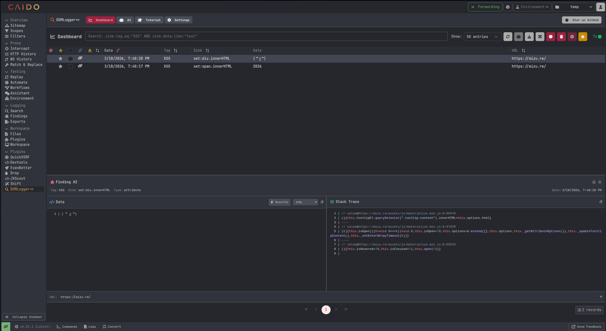
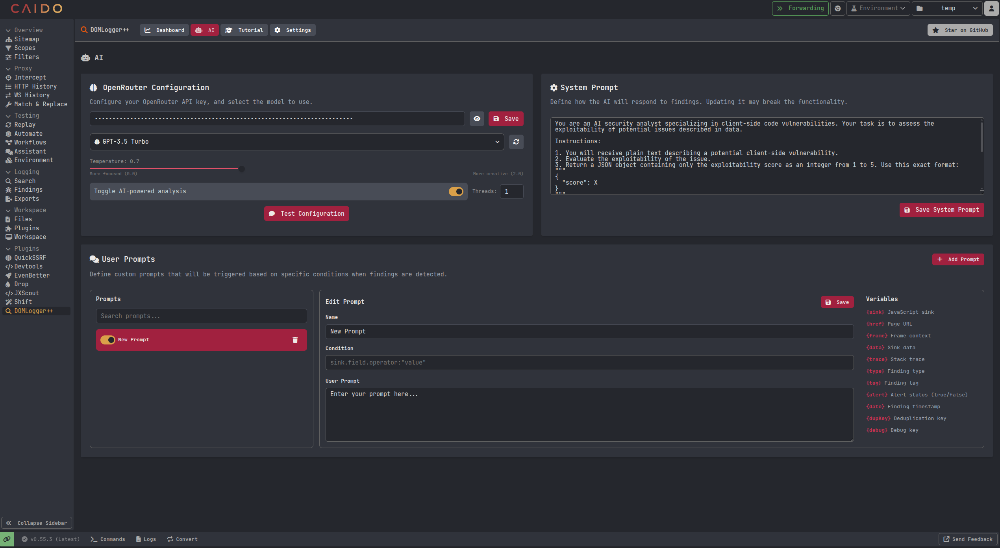
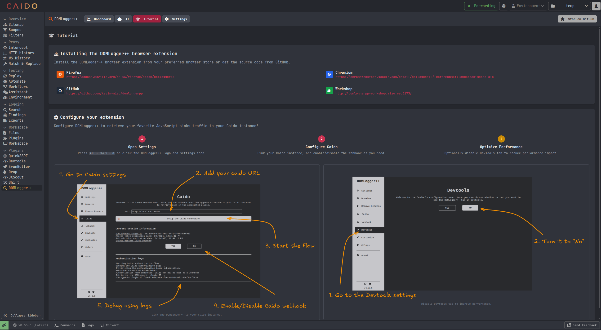
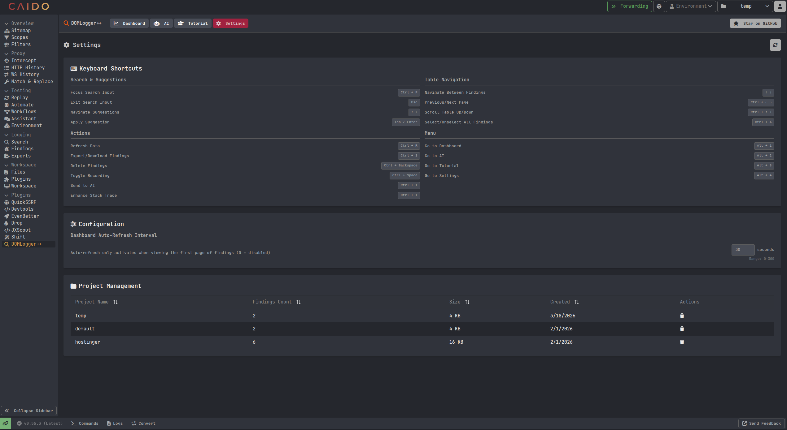

<p align="center">
    <br>
    A Caido plugin to monitor, intercept, and debug JavaScript sinks based on customizable configurations.
    <br>
    
    <a href="https://twitter.com/intent/follow?screen_name=kevin_mizu" title="Follow"></a>
    <br>
</p>

> **DOMLogger++ Caido** is the companion [Caido](https://caido.io/) plugin for the [DOMLogger++](https://github.com/kevin-mizu/domloggerpp) browser extension. It receives findings from the extension via a webhook, stores them in a local database, and provides a powerful interface to search, analyze, and triage JavaScript sink findings — with optional AI-powered exploitability scoring.

<br>

## 📦 Installation

1. Install the **DOMLogger++ browser extension** from your preferred store:
    - Firefox: https://addons.mozilla.org/en-US/firefox/addon/domloggerpp
    - Chromium: https://chromewebstore.google.com/detail/domlogger++/lkpfjhmpbmpflldmdpdoabimdbaclolp

2. Install the **DOMLogger++ Caido plugin** from the Caido community store, or build it manually:

```bash
git clone https://github.com/kevin-mizu/domloggerpp-caido
cd domloggerpp-caido
pnpm install
pnpm build
```

3. Link the browser extension to your Caido instance by following the **Tutorial** tab inside the plugin.

<br>

## 🌟 Features

- [x] Real-time JavaScript sink monitoring via the DOMLogger++ browser extension.
- [x] Advanced search & filter syntax with autocomplete suggestions.
- [x] AI-powered exploitability scoring via OpenRouter (100+ models supported).
- [x] Custom AI user prompts with conditional triggers.
- [x] Enhanced stack traces with actual source code context.
- [x] Project management to organize findings by target.
- [x] Recording sessions to isolate findings during active testing.
- [x] Bulk operations: delete, favorite, export, and AI score findings.
- [x] Auto-refresh dashboard with configurable interval.
- [x] Keyboard shortcuts for fast navigation and actions.

<br>

## 🖥️ Dashboard

<p align="center">
    
</p>

The dashboard is the central hub for managing your findings. It provides:

1. **Search bar**: Filter findings using the advanced search syntax with autocomplete.
2. **Findings table**: Paginated table with sorting, selection, and inline actions.
3. **Finding details**: Detailed view of a selected finding with syntax-highlighted data and stack trace.
4. **Bulk actions**: Refresh, export, delete, toggle recording, send to AI, and enhance traces.

<br>

## 🔍 Search syntax

The plugin supports a powerful search syntax to filter findings:

```
sink.field.operator:"value"
```

**Available fields**: `id`, `dupKey`, `debug`, `aiScore`, `alert`, `tag`, `type`, `date`, `href`, `frame`, `sink`, `data`, `trace`, `favorite`

**Operators**:
| Operator | Description |
|----------|-------------|
| `eq` | Equal |
| `ne` / `neq` | Not equal |
| `cont` | Contains |
| `ncont` | Not contains |
| `like` | SQL LIKE pattern (`%` wildcard) |
| `nlike` | SQL NOT LIKE |

**Logical operators**: `AND`, `OR`, and parentheses for grouping.

**Examples**:
```
sink.tag.eq:"XSS" AND sink.data.like:"test"
sink.sink.cont:"innerHTML" OR sink.sink.cont:"outerHTML"
(sink.type.eq:"attribute" OR sink.type.eq:"function") AND sink.tag.eq:"XSS"
```

<br>

## 🤖 AI

<p align="center">
    
</p>

The AI feature automatically scores findings for exploitability using [OpenRouter](https://openrouter.ai/):

- **OpenRouter Configuration**: Set your API key, select a model (100+ available), and adjust the temperature.
- **System Prompt**: Customize the AI's behavior for vulnerability analysis. The default prompt instructs the AI to return an exploitability score from 1 (Very Low) to 5 (Critical).
- **User Prompts**: Define custom prompts triggered by specific conditions using the same filter syntax as the search bar. Use template variables (`{sink}`, `{data}`, `{trace}`, `{href}`, `{frame}`, `{type}`, `{tag}`, `{alert}`, `{date}`, `{dupKey}`, `{debug}`) to inject finding data into prompts.
- **Automatic scoring**: When AI is enabled and a finding matches a user prompt condition, it is automatically queued for scoring.
- **Thread control**: Configure the number of parallel AI threads for faster processing.

<br>

## 📚 Tutorial

<p align="center">
    
</p>

The Tutorial tab guides you through linking the DOMLogger++ browser extension to your Caido instance:

1. Open the DOMLogger++ extension settings and navigate to the **Caido** section.
2. Enter your Caido instance URL and start the authentication flow.
3. Enable/disable the Caido webhook in the extension settings.
4. Optionally disable the DevTools panel to improve performance.

<br>

## ⚙️ Settings

<p align="center">
    
</p>

- **Keyboard Shortcuts**: Reference for all available shortcuts.
- **Dashboard Auto-Refresh**: Configure the refresh interval (0 = disabled, up to 300 seconds).
- **Project Management**: View, manage, and delete projects. Each project stores findings in its own isolated database table.

<br>

## ⌨️ Shortcuts

**Search & Suggestions**
| Shortcut | Action |
|----------|--------|
| `Ctrl + F` | Focus search input |
| `Esc` | Exit search input |
| `↑` `↓` | Navigate suggestions |
| `Tab` / `Enter` | Apply suggestion |

**Table Navigation**
| Shortcut | Action |
|----------|--------|
| `↑` `↓` | Navigate between findings |
| `Ctrl + ←` `→` | Previous/Next page |
| `Ctrl + ↑` `↓` | Scroll table up/down |
| `Ctrl + A` | Select/Unselect all findings |

**Actions**
| Shortcut | Action |
|----------|--------|
| `Ctrl + R` | Refresh data |
| `Ctrl + S` | Export/Download findings |
| `Ctrl + Backspace` | Delete findings |
| `Ctrl + Space` | Toggle recording |
| `Ctrl + I` | Send to AI |
| `Ctrl + T` | Enhance stack trace |

**Menu**
| Shortcut | Action |
|----------|--------|
| `Alt + 1` | Go to Dashboard |
| `Alt + 2` | Go to AI |
| `Alt + 3` | Go to Tutorial |
| `Alt + 4` | Go to Settings |

<br>

## 🧰 Workshop

- [GreHack](https://x.com/GrehackConf) 2024: http://domloggerpp-workshop.mizu.re:5173/
